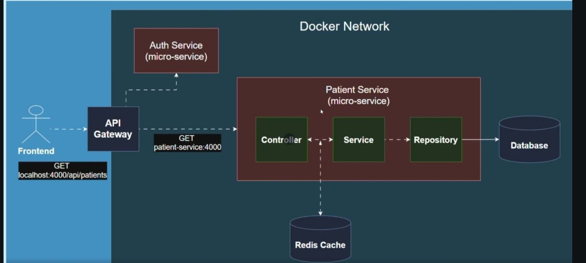
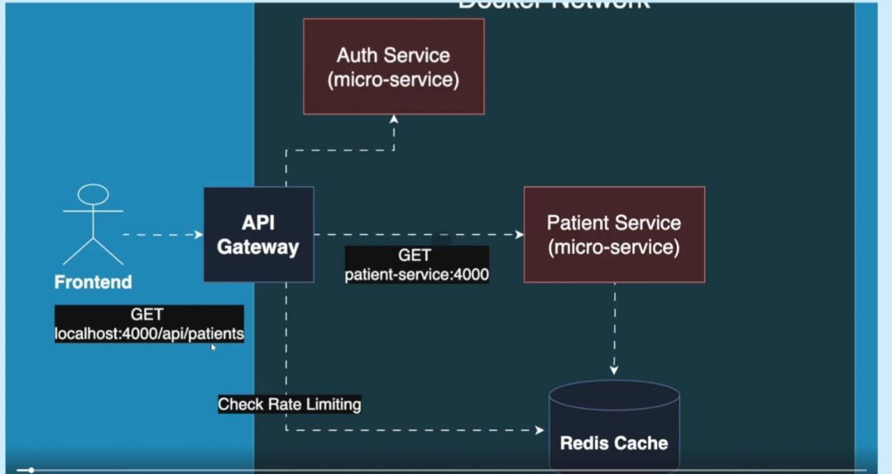
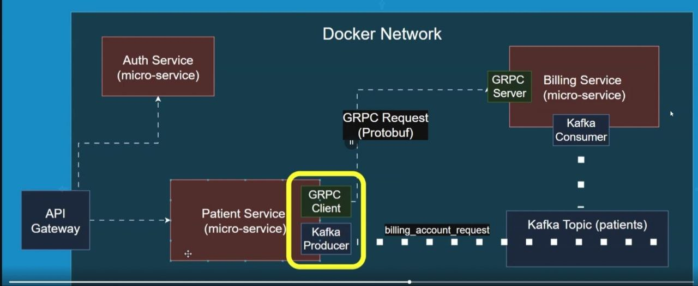
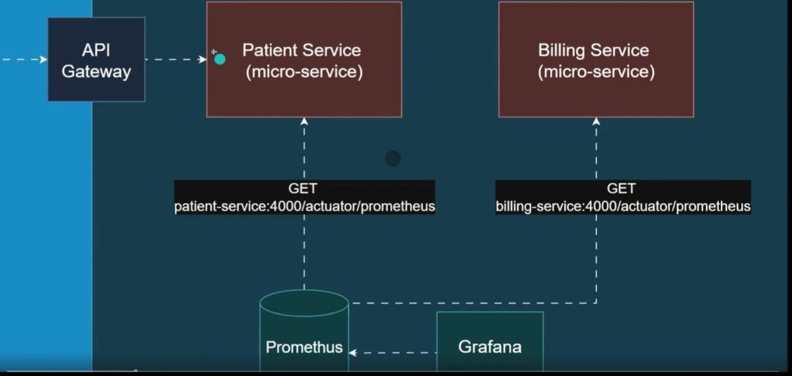
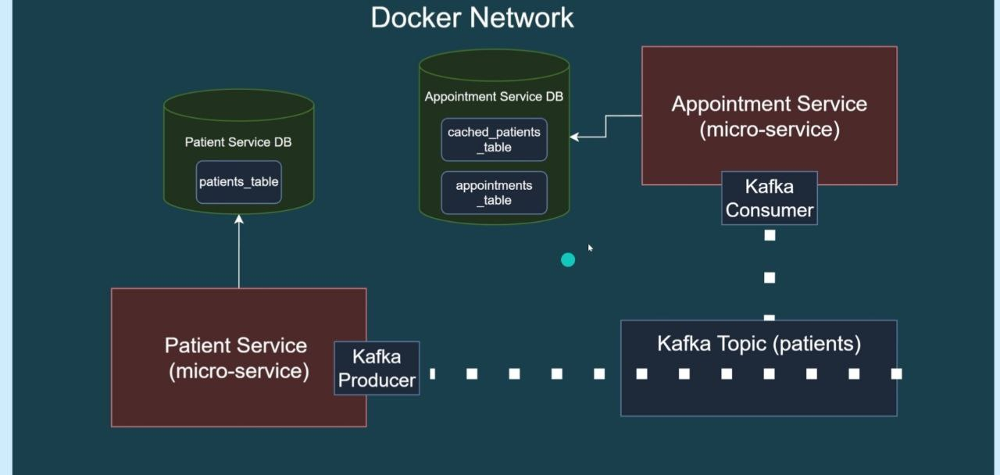

[//]: # (Some src/test folders are deleted to avoid custom environment variables causing build failures.)

# PMS 

## Basic Infrastructure

## Redis Caching

## Rate Limiting

## Circuit Breaker and Resiliency

## Observability and Monitoring

## CQRS
